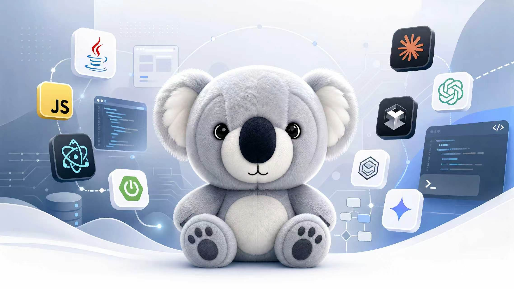

<div align="center">
  <!-- 本地 Banner + 动态胶囊渲染叠加 -->
  
  
  
  <!-- 打字机动效 -->
  <a href="https://git.io/typing-svg">
    
  </a>
  <br/>
  
  
  <br/>

  <!-- 社交链接 -->
  <a href="mailto:bo7785888@gmail.com">
    
  </a>
  <a href="https://github.com/Siborne">
    
  </a>
  <a href="https://siborne.top">
    
  </a>
  <a href="https://space.bilibili.com/511148907">
    
  </a>
</div>

<br/>

---

### 👨‍💻 About Me

```javascript
const Siborne = {
    pronouns: "He" | "Him",
    identity: ["Full-Stack Developer", "AI Agent Engineer", "Student"],
    internship: {
        company: "Kingsoft Office (WPS)",
        role: "Data Analysis Intern",
        period: "Dec 2025 – Present"
    },
    askMeAbout: [
        "🤖 AI Agent Engineering",
        "⚙️ SOP Automation",
        "🐧 Spring Ecosystem",
        "🚀 Vibe Coding"
    ],
    technologies: {
        backEnd: {
            java: ["Spring Boot 3", "Spring Cloud Alibaba ☁️", "Spring AI", "MyBatis-Plus"],
            js: ["Node.js", "Express"],
            architecture: ["Microservices", "Event-Driven", "RESTful APIs"]
        },
        frontEnd: {
            frameworks: ["Vue.js 3 🐦", "React ⚛️", "Next.js", "Electron ⚡"],
            css: ["Tailwind 🎨", "Sass", "Element Plus 📦"],
            logic: ["Pinia", "Vite", "Responsive Design"]
        },
        cloudNative: {
            container: ["Docker 🐳", "Kubernetes (K8s) ☸️"],
            devOps: ["CI/CD", "GitHub Actions 🤖", "Nginx 🛡️", "Jenkins"],
            cloud: ["AWS (Fargate, Lambda, S3)", "Alibaba Cloud"]
        },
        aiAgent: {
            core: ["GPT 🤖", "Vectorization 🗺️", "AI-driven SOPs", "Prompt Engineering"],
            tools: ["Cursor", "Trae", "Code Review Automation"]
        },
        databases: ["MySQL 📊", "Redis 🚀", "PostgreSQL", "MongoDB", "SQLite"],
        efficiency: ["Obsidian 📒", "Mermaid.js 📊", "Markdown Masters"]
    },
    funFact: "I can debug faster with a coffee in hand ☕!"
};
```

<br/>

---

### 🛠️ Tech Stack

<div align="center">
  <table>
    <tr>
      <td width="70%" valign="top">
        <h4>☁️ Cloud Native & Infrastructure</h4>
        <a href="https://skillicons.dev">
          
        </a>
        <br/>
        <h4>☕ Back-End & AI Development</h4>
        <a href="https://skillicons.dev">
          
        </a>
        <br/>
        <h4>🎨 Front-End & Cross-Platform</h4>
        <a href="https://skillicons.dev">
          
        </a>
        <br/>
        <h4>✍️ Productivity & Knowledge Base</h4>
        <a href="https://skillicons.dev">
          
        </a>
      </td>
      <td width="30%" valign="top" align="center">
        
      </td>
    </tr>
  </table>
</div>

<br/>

---

### 📊 GitHub Stats

<div align="center">
  
  
</div>
<div align="center">
  
</div>

<br/>

---

### 🐍 Contribution Snake

<div align="center">
  <picture>
    <source media="(prefers-color-scheme: dark)" srcset="https://raw.githubusercontent.com/Siborne/Siborne/output/github-contribution-grid-snake-dark.svg">
    <source media="(prefers-color-scheme: light)" srcset="https://raw.githubusercontent.com/Siborne/Siborne/output/github-contribution-grid-snake.svg">
    
  </picture>
</div>

<br/>

---
<div align="center">
  
</div>
