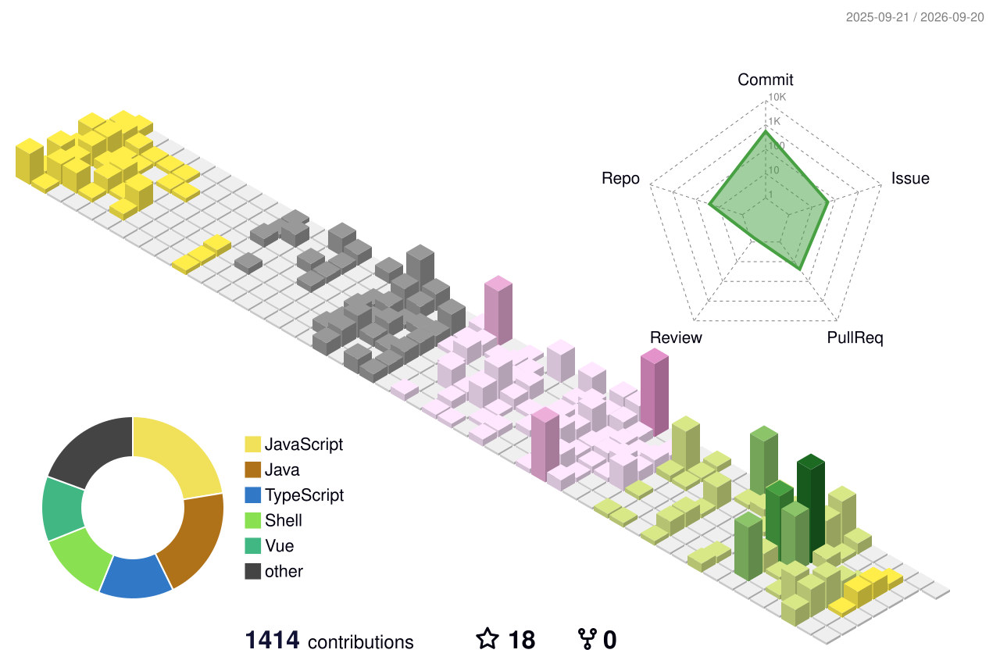

  <!-- 本地 Banner + 动态胶囊渲染叠加 -->
  

  <!-- 打字机动效 -->
 <!-- <a href="https://git.io/typing-svg"> -->
 <!--    -->
 <!-- </a> -->
  
   

  <!-- 社交链接 -->
  
  
  
  
  

### 👋 Hello, I'm Siborne

I'm a **Data R&D Engineer & Student** who enjoys building things with **Java, AI, and open source**.

Currently exploring **AI Agents, data infrastructure, automation, and full-stack development**.
I like turning ideas into tools that are actually useful. 🚀

**Build · Learn · Share · Repeat.**

 <!-- 

  <h2>Building in the AI Era</h2>
  
AI Agent & Full-Stack Developer · Agentic Coding Enthusiast · Student Builder

  
I build agentic workflows, full-stack systems, and automation pipelines, turning ideas into usable products.

 -->

### 📊 GitHub Stats And Contribution

  <!--
  -->

<!-- 

### 🌐 3D Contribution Profile

  

 -->

<!-- 

### 💼 Professional Experience

**Data Analysis Intern | Kingsoft Office (WPS)** _Dec 2025 – Aug 2026_ 

### 💬 Get in touch

- **Current Focus**: Leading Java full-stack development with Generative AI integration. 
- **Fun Fact**: I can debug faster with a coffee in hand ☕!

 <em><b>I love connecting with different people</b> so if you want to say <b>hi, I'll be happy to meet you more!</b> 😊</em>

 -->
